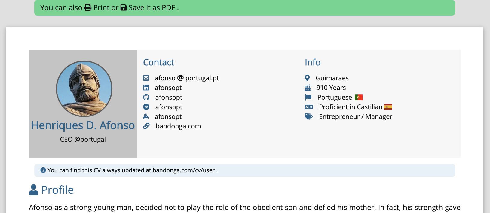

# jekyllcv

CV based on YAML, using [jekyll](https://github.com/jekyll/jekyll). [Github Repository: marcelofpfelix/jekyllcv](https:///github.com/marcelofpfelix/jekyllcv)

Converts this [yaml file](https://github.com/marcelofpfelix/jekyllcv/blob/master/_data/users.yml) in the printing html page seen bellow.

```yaml
user:
  name: "Henriques D. Afonso"
  avatar: /assets/img/afonso.jpg
  bio: CEO @portugal
  url: bandonga.com/cv/user
  email_user  : afonso
  email_domain : portugal.pt
  links:
    - linkedin
    - github
```

[](user)

### Example

To see an example, please check the **[demo](user)** CV , using this [yaml file](https://github.com/marcelofpfelix/jekyllcv/blob/master/_data/users.yml).


### Using:
* **[jekyll/jekyll](https://github.com/jekyll/jekyll):** static site generator
* **[FortAwesome/Font-Awesome](https://github.com/FortAwesome/Font-Awesome):** icon toolkit
* **[cognitom/paper-css](https://github.com/cognitom/paper-css):** front-end printing solution
* **[necolas/normalize.css](https://github.com/necolas/normalize.css):** CSS resets
* **[google/fonts](https://github.com/google/fonts):** catalog with fonts
* **[lipis/flag-icon-css](https://github.com/lipis/flag-icon-css):** collection with country flags in CSS
* **[jquery/jquery](https://github.com/jquery/jquery):** lib to simplify HTML DOM selection
* **[moment/moment](https://github.com/moment/moment):** lib to calculate dates
* **[davatron5000/FitText.js](https://github.com/davatron5000/FitText.js):** font resizing

### Inspired by:
* **[AnotherKamila/yamlCV](https://github.com/AnotherKamila/yamlCV)**
* **[mmistakes/minimal-mistakes](https://github.com/mmistakes/minimal-mistakes)**
