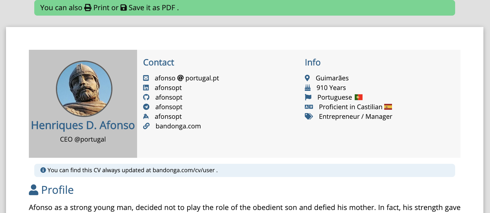

# jekyllcv

CV based on YAML, using [jekyll](https://github.com/jekyll/jekyll).
  * [Github Repository: marcelofpfelix/jekyllcv](https://github.com/marcelofpfelix/jekyllcv)
  * [webpage: marcelofpfelix.github.io/jekyllcv](https://marcelofpfelix.github.io/jekyllcv)

Converts this [yaml file](https://github.com/marcelofpfelix/jekyllcv/blob/master/_data/users.yml) in the printing html page seen bellow.

```yaml
user:
  name: "Henriques D. Afonso"
  avatar: assets/img/afonso.jpg
  bio: CEO @portugal
  url: marcelofpfelix.github.io/jekyllcv/user
  email_user  : afonso
  email_domain : portugal.pt
  links:
    - linkedin
    - github
```

[](https://marcelofpfelix.github.io/jekyllcv/user)

### Example

To see an example, please check the **[demo](https://marcelofpfelix.github.io/jekyllcv/user)** CV , using this [yaml file](https://github.com/marcelofpfelix/jekyllcv/blob/master/_data/users.yml).
  * You can also check *Marcelo Félix* real CV, available at  **[bandonga.com/cv/marcelo](https://bandonga.com/cv/marcelo)**, using this [yaml file](https://github.com/bandonga/cv/blob/master/_data/users.yml).

Source code is available in the **[GitHub repository](https://github.com/marcelofpfelix/jekyllcv)**.
